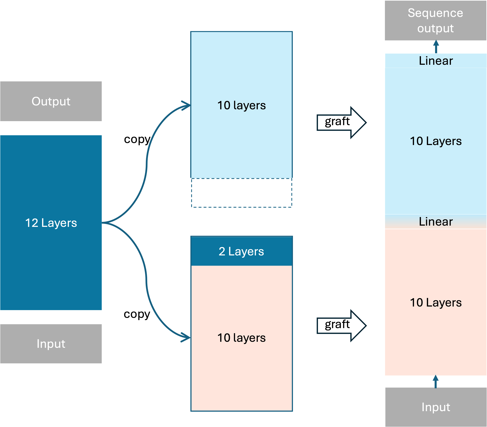

# AbGraftBERT

## Introduction

<p align="center"></p>
<p align="center"><b>Schematic illustration of the ABGNN framework</b></p>


The AbBERT is the pre-trained antibody model. Its `soft' prediction will be fed into the sequence GNN $\cal{H}$<sub>seq</sub>, after encoding and generating the updated sequence, structure GNN $\cal{H}$<sub>str</sub> encodes the updated graph and then predict the structures. The sequence and structure prediction iteratively refine $T$ times.


## Dependencies

- pytorch==1.12.0
- fairseq==0.10.2
- numpy==1.23.3

## Pretrain a model on sequence data

All preprocessed data was from [ABGNN](https://github.com/KyGao/ABGNN)
For  training, we can run:
```shell
bash pretrain-abbert.sh
```

## Finetune on sequence and structure co-design tasks

For experiment 1, raw data is from [MEAN](https://github.com/THUNLP-MT/MEAN), code is from [ABGNN](https://github.com/KyGao/ABGNN). 

For experiment 2, raw data is from [HSRN](https://github.com/wengong-jin/abdockgen), code is from [ABGNN](https://github.com/KyGao/ABGNN). 

For experiment 3, raw data is from [RefineGNN](https://github.com/wengong-jin/RefineGNN), code is from [ABGNN](https://github.com/KyGao/ABGNN). 

The finetuning scripts are following:

```shell
# for exp1
bash finetune-exp1.sh

# for exp2
bash finetune-exp2.sh

# for exp3
# have to additionally install pytorch_lightning, matplotlib, and igfold
bash finetune-exp3.sh
bash covid-optimize.sh
```

We can simply run the following code for inference:

```shell
python inference.py \
    --cdr_type ${CDR} \
    --cktpath ${model_ckpt_path}}/checkpoint_best.pt \
    --data_path ${dataset_path}
```
